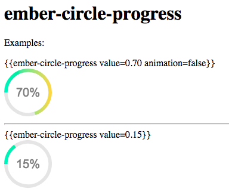

ember-circle-progress
==============================================================================

[](https://travis-ci.org/hugoruscitti/ember-circle-progress)


Demo: http://ember-circle-progress.surge.sh/

Installation
------------------------------------------------------------------------------

```
ember install ember-circle-progress
```


Usage
------------------------------------------------------------------------------





Contributing
------------------------------------------------------------------------------

### Installation

* `git clone <repository-url>`
* `cd ember-circle-progress`
* `npm install`

### Linting

* `npm run lint:js`
* `npm run lint:js -- --fix`

### Running tests

* `ember test` – Runs the test suite on the current Ember version
* `ember test --server` – Runs the test suite in "watch mode"
* `npm test` – Runs `ember try:each` to test your addon against multiple Ember versions

### Running the dummy application

* `ember serve`
* Visit the dummy application at [http://localhost:4200](http://localhost:4200).

For more information on using ember-cli, visit [https://ember-cli.com/](https://ember-cli.com/).

License
------------------------------------------------------------------------------

This project is licensed under the [MIT License](LICENSE.md).
